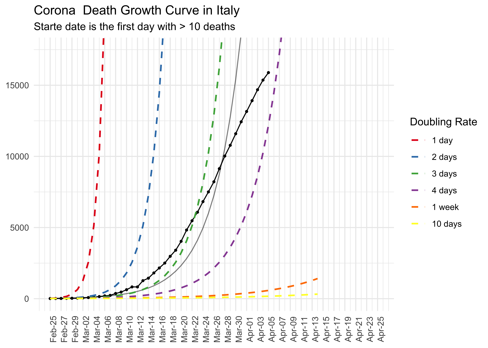
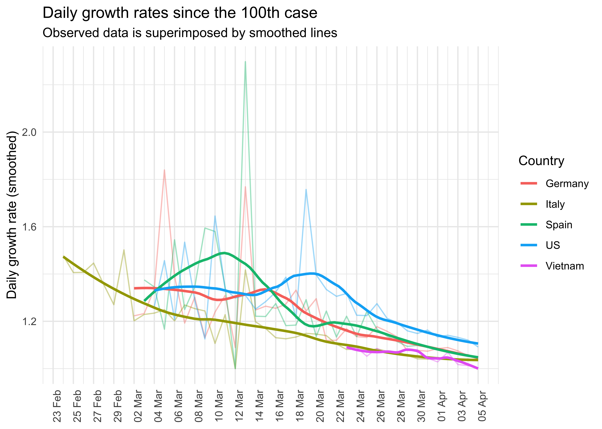
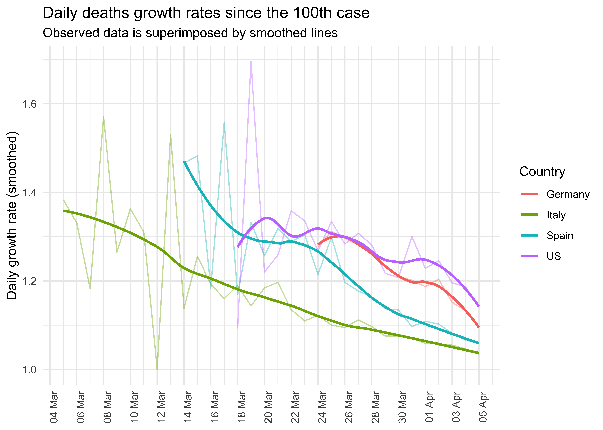

<!-- README.md is generated from README.Rmd. Please edit that file -->

# corona

<!-- badges: start -->

<!-- badges: end -->

This package support to import, prepare, model and visualize the data
about COVID19 infections from the Johns Hopkins University github
repository.

## Installation

You can install the released version of corona from
[github](github.com/jnshsrs/corona) with:

``` r
install.packages("devtools")
devtools::install_github("jnshsrs/corona")
```

## Import JHU corona data

To load the dataset, just call `read_corona()`. The function will fetch
the latest data from the JHU github repository.

Opposed to the JHU github data, which is structured in a wide format
(each day has a column and each row represents a country), this dataset
is rearranged into a long format where each country and day reprents a
row.

``` r
library(dplyr, warn.conflicts = FALSE)
library(corona)

# Import the corona
data <- read_corona()

data
#> # A tibble: 19,875 x 7
#>    country     date         Lat  Long infections deaths recoveries
#>    <chr>       <date>     <dbl> <dbl>      <dbl>  <dbl>      <dbl>
#>  1 Afghanistan 2020-01-22    33    65          0      0          0
#>  2 Afghanistan 2020-01-23    33    65          0      0          0
#>  3 Afghanistan 2020-01-24    33    65          0      0          0
#>  4 Afghanistan 2020-01-25    33    65          0      0          0
#>  5 Afghanistan 2020-01-26    33    65          0      0          0
#>  6 Afghanistan 2020-01-27    33    65          0      0          0
#>  7 Afghanistan 2020-01-28    33    65          0      0          0
#>  8 Afghanistan 2020-01-29    33    65          0      0          0
#>  9 Afghanistan 2020-01-30    33    65          0      0          0
#> 10 Afghanistan 2020-01-31    33    65          0      0          0
#> # … with 19,865 more rows
```

Additionally, the corona-package comes with reader functions for the
three statistics, i.e., number of infections, number of deaths and
number of recoveries, but these functions are mainly used as helper
functions for the `read_corona`.

``` r

# Import numbers of infection 
read_infections()

# Import numbers of deaths
read_deaths()

# Import number of recoveries
read_recoveries()
```

# Prepare the data

To work with the data, we have to preprocess the data

``` r

# Prepare data
data_germany <- data %>% 
  preprocess_corona_data(statistic = "infections", 
                         countries = "Germany", 
                         n = 100)
```

# Predict cases

``` r

# Predict the cases
data_germany %>% predict_growth() 
#> # A tibble: 40 x 7
#> # Groups:   country [1]
#>    country   Lat  Long date       statistic   day predicted_cases
#>    <chr>   <dbl> <dbl> <date>         <dbl> <int>           <dbl>
#>  1 Germany    51     9 2020-03-01       130     1            257.
#>  2 Germany    51     9 2020-03-02       159     2            312.
#>  3 Germany    51     9 2020-03-03       196     3            380.
#>  4 Germany    51     9 2020-03-04       262     4            462.
#>  5 Germany    51     9 2020-03-05       482     5            562.
#>  6 Germany    51     9 2020-03-06       670     6            683.
#>  7 Germany    51     9 2020-03-07       799     7            831.
#>  8 Germany    51     9 2020-03-08      1040     8           1011.
#>  9 Germany    51     9 2020-03-09      1176     9           1230.
#> 10 Germany    51     9 2020-03-10      1457    10           1496.
#> # … with 30 more rows
```

# Plot the growth curve of infected cases

``` r

# Data pipeline
data %>% 
  preprocess_corona_data(statistic = "infections", 
                         countries = "Spain", 
                         n = 100) %>% 
  predict_growth() %>% 
  plot_country(show_model = TRUE)
```


# Plot the number of deaths

``` r
# Data pipeline
data %>% 
  preprocess_corona_data(statistic = "deaths", 
                         countries = "Italy", 
                         n = 10) %>% 
  predict_growth() %>%
  plot_country(show_model = TRUE) +
  ggplot2::ggtitle("Corona  Death Growth Curve in Italy", 
                   subtitle = "Starte date is the first day with > 10 deaths")
#> Warning: Removed 1 row(s) containing missing values (geom_path).
```



# Look at the Growth Model

The function `lm_corona` takes a preprocessed corona dataset (as tibble
or dataframe) and returns a dataframe with the parameters of a
exponential growth model.

The column base\_rate and growth rate indicte the initial case numbers
and the estimated growth across the entire time period.

``` r
data %>%
  preprocess_corona_data(
    countries = "Germany",
    statistic = "infections",
    n = 100
  ) %>% 
  lm_corona()
#> # A tibble: 1 x 7
#> # Groups:   country [1]
#>   country models  r_sq lm_intercept lm_slope base_rate growth_rate
#>   <chr>   <list> <dbl>        <dbl>    <dbl>     <dbl>       <dbl>
#> 1 Germany <lm>   0.958         2.32   0.0851      211.        1.22
```

The funcition `plot_country` plots the exponential growth model for the
given country (note that this function can process only one country, a
function to compare countries is not available so far).

``` r
# Data pipeline
data %>% 
  preprocess_corona_data(statistic = "deaths", 
                         countries = "Germany", 
                         n = 100) %>% 
  predict_growth() %>%
  plot_country(show_model = TRUE) +
  ggplot2::ggtitle("Number of cumulative deaths in Germany", 
                   "Days since the 100th case included")
#> Warning: Removed 96 row(s) containing missing values (geom_path).
```


``` r
# Data pipeline
data %>% 
  preprocess_corona_data(statistic = "infections", 
                         countries = "Germany", 
                         n = 10000) %>% 
  predict_growth() %>%
  plot_country(show_model = TRUE) +
  ggplot2::ggtitle("Number of cumulative deaths in Germany", 
                   "Days since the 10000th (1e4) case included")
#> Warning: Removed 66 row(s) containing missing values (geom_path).
```


``` r

data %>% 
  group_by(country, date) %>% 
  summarise_at(c("infections", "deaths", "recoveries"), sum)
#> # A tibble: 13,725 x 5
#> # Groups:   country [183]
#>    country     date       infections deaths recoveries
#>    <chr>       <date>          <dbl>  <dbl>      <dbl>
#>  1 Afghanistan 2020-01-22          0      0          0
#>  2 Afghanistan 2020-01-23          0      0          0
#>  3 Afghanistan 2020-01-24          0      0          0
#>  4 Afghanistan 2020-01-25          0      0          0
#>  5 Afghanistan 2020-01-26          0      0          0
#>  6 Afghanistan 2020-01-27          0      0          0
#>  7 Afghanistan 2020-01-28          0      0          0
#>  8 Afghanistan 2020-01-29          0      0          0
#>  9 Afghanistan 2020-01-30          0      0          0
#> 10 Afghanistan 2020-01-31          0      0          0
#> # … with 13,715 more rows
```

# Daily growths rates of infections

``` r
library(ggplot2)

data %>% 
  preprocess_corona_data(statistic = "infections",
                         countries = c("Germany",
                                       "Italy", 
                                       "Spain",
                                       "US",
                                       "Vietnam"),
                         n = 100) %>% 
  mutate(daily_growth_rate = statistic / lag(statistic)) %>% 
  filter(!is.na(daily_growth_rate)) %>% 
  ggplot(aes(x = date, y = daily_growth_rate, col = country)) +
  geom_line(alpha = .4) +
  geom_smooth(method = "loess", se = FALSE, span = .55) +
  scale_y_continuous("Daily growth rate (smoothed)") +
  scale_x_date(breaks = seq(min(data$date),
                            max(data$date),
                            by = "2 days"), 
               label = scales::date_format(format = "%d %b")) + 
  scale_color_discrete("Country") +
  theme_minimal() +
  theme(axis.text.x = element_text(angle = 90), 
        axis.title.x = element_blank()) +
  ggtitle("Daily growth rates since the 100th case",
          "Observed data is superimposed by smoothed lines")
#> `geom_smooth()` using formula 'y ~ x'
```



# Daily growth rate of deaths

``` r
library(ggplot2)

data %>% 
  preprocess_corona_data(statistic = "deaths",
                         countries = c("Germany",
                                       "Italy", 
                                       "Spain",
                                       "US",
                                       "Vietnam"),
                         n = 100) %>% 
  mutate(daily_growth_rate = statistic / lag(statistic)) %>% 
  filter(!is.na(daily_growth_rate)) %>% 
  ggplot(aes(x = date, y = daily_growth_rate, col = country)) +
  geom_line(alpha = .4) +
  geom_smooth(method = "loess", formula = "y ~ x", se = FALSE, span = .55) +
  scale_y_continuous("Daily growth rate (smoothed)") +
  scale_x_date(breaks = seq(min(data$date),
                            max(data$date) + lubridate::days(3),
                            by = "2 days"), 
               label = scales::date_format(format = "%d %b")) + 
  scale_color_discrete("Country") +
  theme_minimal() +
  theme(axis.text.x = element_text(angle = 90), 
        axis.title.x = element_blank()) +
  ggtitle("Daily deaths growth rates since the 100th case",
          "Observed data is superimposed by smoothed lines")
```



``` r
data %>% 
  preprocess_corona_data(statistic = "infections",
                         countries = c("Germany",
                                       "Italy", 
                                       "Spain",
                                       "US",
                                       "Vietnam"),
                         n = 7000) %>% 
  mutate(daily_growth_rate = statistic / lag(statistic)) %>% 
  mutate_at("daily_growth_rate", function(x) x - 1) %>% 
  filter(country == c("Germany")) %>% 
  mutate(format = scales::percent(daily_growth_rate, accuracy = 1)) %>% 
  filter(!is.na(daily_growth_rate)) %>% 
  ggplot(aes(x = date, y = statistic)) +
  geom_point(aes(size = daily_growth_rate)) +
  geom_line(linetype = 3, size = .5) +
  geom_text(aes(label = format), nudge_x = 0, nudge_y = .2) +
  scale_y_log10("Cumulative Infections", 
                breaks = c(1e4, 2e4, 5e4, 1e5, 2e5, 5e5),
                limits = c(1e4, 5e5),
                labels = c("10k", "20k", "50k", "100k", "200k", "500k"),
                minor_breaks = NULL) +
  facet_wrap(~ country, ncol = 1) +
  theme_minimal()  +
  scale_size("Daily Growth Rate", labels = scales::percent) +
  scale_x_date(breaks = seq(min(data$date),
                            max(data$date) + lubridate::days(3),
                            by = "2 days"), 
               label = scales::date_format(format = "%d %b")) +
  theme(legend.position = "bottom",
        axis.title.x = element_blank(), 
        axis.text.x = element_text(angle = 90)) +
  ggtitle("Cumulative Infection Count", "Daily Growth Rate for each Day in percent")
#> Warning: Removed 1 rows containing missing values (geom_point).
#> Warning: Removed 1 row(s) containing missing values (geom_path).
#> Warning: Removed 1 rows containing missing values (geom_text).
```


