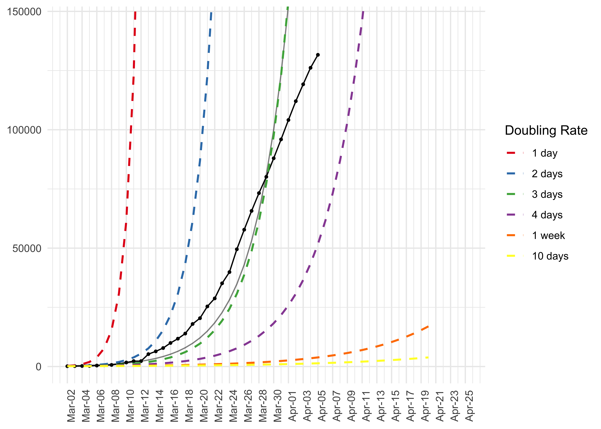

<!-- README.md is generated from README.Rmd. Please edit that file -->

# corona

<!-- badges: start -->

<!-- badges: end -->

This package support to import, prepare, model and visualize the data
about COVID19 infections from the Johns Hopkins University github
repository.

## Installation

You can install the released version of corona from
[github](github.com/jnshsrs/corona) with:

``` r
install.packages("devtools")
devtools::install_github("jnshsrs/corona")
```

## Import JHU corona data

To load the dataset, just call `read_corona()`. The function will fetch
the latest data from the JHU github repository.

Opposed to the JHU github data, which is structured in a wide format
(each day has a column and each row represents a country), this dataset
is rearranged into a long format where each country and day reprents a
row.

``` r
library(corona)
library(dplyr)

# Import the corona
data <- read_corona()

data
#> # A tibble: 18,864 x 8
#>    state country       Lat  Long date       infections deaths recoveries
#>    <chr> <chr>       <dbl> <dbl> <date>          <dbl>  <dbl>      <dbl>
#>  1 <NA>  Afghanistan    33    65 2020-01-22          0      0          0
#>  2 <NA>  Afghanistan    33    65 2020-01-23          0      0          0
#>  3 <NA>  Afghanistan    33    65 2020-01-24          0      0          0
#>  4 <NA>  Afghanistan    33    65 2020-01-25          0      0          0
#>  5 <NA>  Afghanistan    33    65 2020-01-26          0      0          0
#>  6 <NA>  Afghanistan    33    65 2020-01-27          0      0          0
#>  7 <NA>  Afghanistan    33    65 2020-01-28          0      0          0
#>  8 <NA>  Afghanistan    33    65 2020-01-29          0      0          0
#>  9 <NA>  Afghanistan    33    65 2020-01-30          0      0          0
#> 10 <NA>  Afghanistan    33    65 2020-01-31          0      0          0
#> # … with 18,854 more rows
```

Additionally, the corona-package comes with reader functions for the
three statistics, i.e., number of infections, number of deaths and
number of recoveries, but these functions are mainly used as helper
functions for the `read_corona`.

``` r

# Import numbers of infection 
read_infections()

# Import numbers of deaths
read_deaths()

# Import number of recoveries
read_recoveries()
```

# Prepare the data

To work with the data, we have to preprocess the data

``` r

# Prepare data
data_germany <- data %>% 
  preprocess_corona_data(statistic = "infections", 
                         countries = "Germany", 
                         n = 100)
```

# Predict cases

``` r

# Predict the cases
data_germany %>% predict_growth() 
#> # A tibble: 40 x 7
#> # Groups:   country [1]
#>    country   Lat  Long date       statistic   day predicted_cases
#>    <chr>   <dbl> <dbl> <date>         <dbl> <int>           <dbl>
#>  1 Germany    51     9 2020-03-01       130     1            221.
#>  2 Germany    51     9 2020-03-02       159     2            273.
#>  3 Germany    51     9 2020-03-03       196     3            336.
#>  4 Germany    51     9 2020-03-04       262     4            415.
#>  5 Germany    51     9 2020-03-05       482     5            511.
#>  6 Germany    51     9 2020-03-06       670     6            630.
#>  7 Germany    51     9 2020-03-07       799     7            777.
#>  8 Germany    51     9 2020-03-08      1040     8            958.
#>  9 Germany    51     9 2020-03-09      1176     9           1181.
#> 10 Germany    51     9 2020-03-10      1457    10           1456.
#> # … with 30 more rows
```

# Plot the growth curve

``` r

# Data pipeline
data %>% 
  preprocess_corona_data(statistic = "infections", 
                         countries = "Spain", 
                         n = 100) %>% 
  predict_growth() %>%
  plot_country(show_model = TRUE)
```


